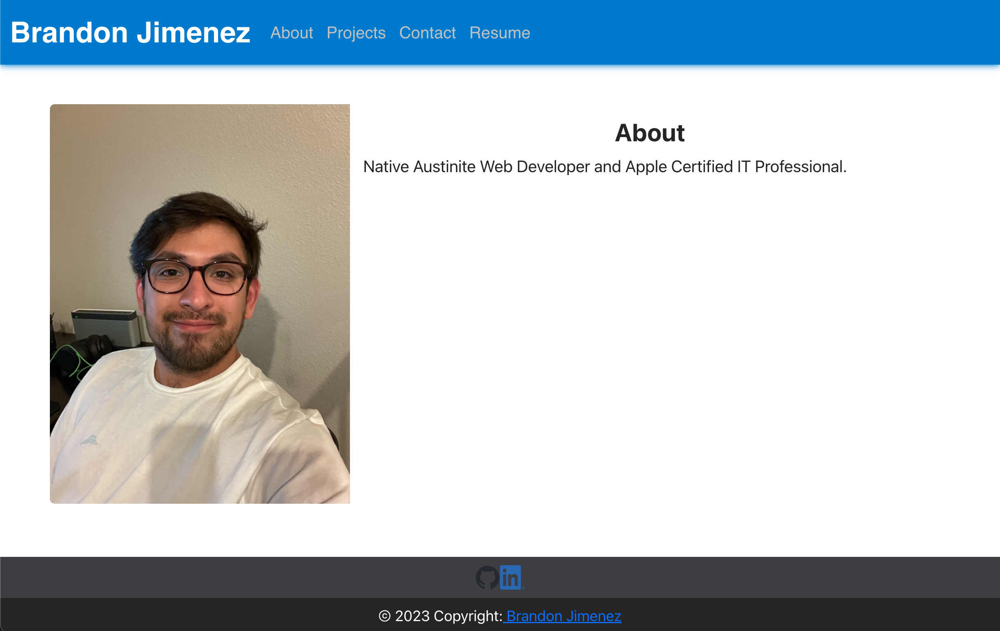

# React Portfolio

## Description

I have created a React Portfolio, that has information about me, and resume. 

Heroku App:
https://bjimenez.herokuapp.com/

 



## Table of Contents

- [Installation](#installation)
- [Usage](#usage)
- [License](#license)
- [Badges](#Badges)


## Installation

To Install:

Run the commands in Terminal:

```
npm install
```

## Usage

Direct your terminal to the repository rooty directory and run this command line to initiate application.
```
npm run start
```
** must have node.js installed 

Direct your browser to "http://localhost:3000/" to view locally.

## License

This application is covered under the MIT license.

## Badges


